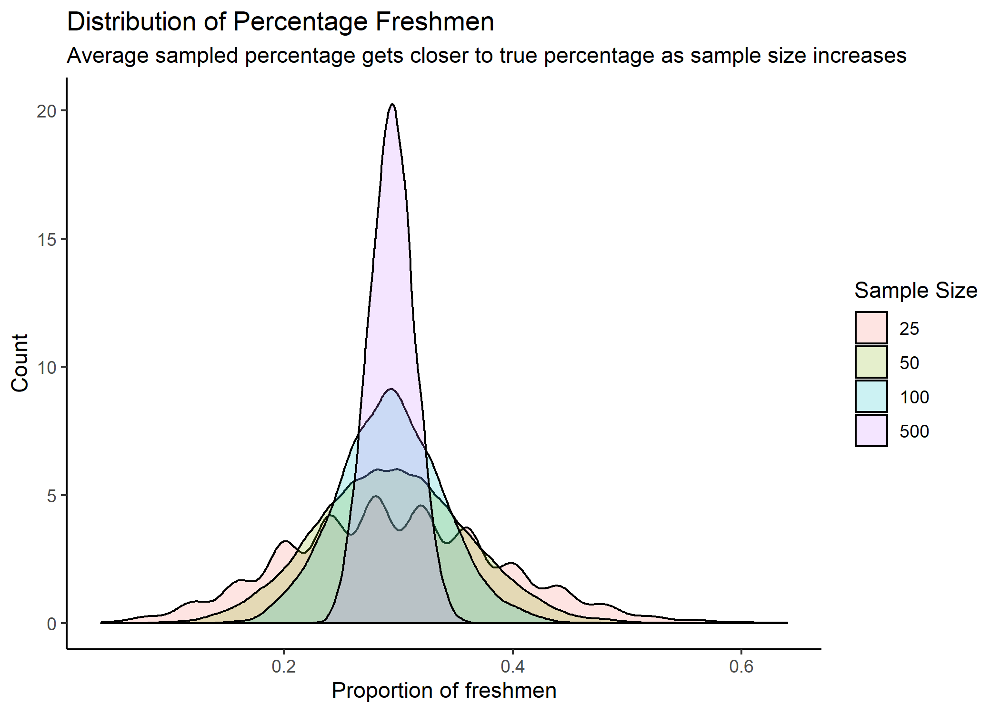

```{r setup, include=FALSE}
knitr::opts_chunk$set(echo = TRUE)

library(tidyverse)
library(haven)
library(formattable)
library(magrittr)
library(gt)
library(infer)
library(knitr)

```

## Mad Libs

```{r mad_lib_1, echo=FALSE}

voters <- read_dta("raw-data/ns20191226/ns20191226.dta")

mad_1 <- voters %>% 
  select(gun_registry) %>% 
  filter(gun_registry != 888) %>% 
  count() %>% 
  pull(n) %>% 
  format(big.mark = ",")

```

**ML 1)** Not all respondents were asked every question. **`r mad_1`** respondents were asked the question about whether the USA should create a gun registry.

```{r mad_lib_2, echo=FALSE}

mad_2 <- voters %>% 
  select(ban_guns,
         gun_registry,
         guns_bg,
         limit_magazines,
         statements_gun_rights,
         household_gun_owner) %>% 
  filter(gun_registry != 888,
         statements_gun_rights != 888) %>% 
  mutate(gun_owner = ifelse(household_gun_owner == 1,
                            TRUE,
                            FALSE)) %>% 
  summarize(mean(gun_owner)) %>% 
  percent(digits = 2)

```

**ML 2)** Of the respondents that got asked all four gun policy questions, **`r mad_2`** are gun owners.

```{r mad_lib_3, echo=FALSE}

no_guns <- voters %>% 
  select(statements_gun_rights,
         household_gun_owner) %>% 
  filter(household_gun_owner == 3,
         statements_gun_rights == 1:4) %>% 
  summarize(mean(statements_gun_rights)) %>% 
  round(digits = 2)

have_guns <- voters %>% 
  select(statements_gun_rights,
         household_gun_owner) %>% 
  filter(household_gun_owner == 1:2, # |
#           household_gun_owner == 999,       should I include this? No, right?
         statements_gun_rights == 1:4) %>% 
  summarize(mean(statements_gun_rights)) %>% 
  round(digits = 2)

```

**ML 3)** The average “agreement” score (from 1-4) on the statement_gun_rights variable is **`r no_guns`** for those respondents who live in households without guns, while the average “agreement” score in households with guns is **`r have_guns`**.

```{r mad_lib_4, echo=FALSE}

mad_4a <- voters %>% 
  filter(age < 30) %>% 
  group_by(religion) %>% 
  count(religion) %>% 
  arrange(desc(n)) %>% 
  mutate(religion_names = as_factor(religion)) %>% 
  mutate(religion_names = as.character(religion_names)) %>% 
  as.data.frame() %>% 
  slice(1) %>% 
  pull(religion_names)

mad_4b <- voters %>% 
  filter(age >= 30) %>% 
  group_by(religion) %>% 
  count(religion) %>% 
  arrange(desc(n)) %>% 
  mutate(religion_names = as_factor(religion)) %>% 
  mutate(religion_names = as.character(religion_names)) %>% 
  as.data.frame() %>% 
  slice(1) %>% 
  pull(religion_names)

# AARRGGGHHHH

```

**ML 4)** Another set of questions asks about religion. The first ranked category of religion for the age group of people 18-30 (don’t include 30) is **"`r mad_4a`."** The first-ranked religion category for people 30 and older is **“`r mad_4b`.”**

```{r mad_lib_5, echo=FALSE}

mad_5a <- voters %>% 
  filter(age < 30) %>% 
  group_by(religion) %>% 
  count(religion) %>% 
  mutate(religion_names = as_factor(religion)) %>% 
  arrange(desc(n)) %>% 
  as.data.frame() %>% 
  mutate(rank = 1:14) %>% 
  filter(religion_names == "Nothing in particular") %>% 
  pull(rank)

mad_5b <- voters %>% 
  filter(age >= 30) %>% 
  group_by(religion) %>% 
  count(religion) %>% 
  mutate(religion_names = as_factor(religion)) %>% 
  arrange(desc(n)) %>% 
  as.data.frame() %>% 
  mutate(rank = 1:14) %>% 
  filter(religion_names == "Nothing in particular") %>% 
  pull(rank)

# give up...

```

**ML 5)** Lots of people say that the younger generation has the highest percent of “nones” (people who answer “nothing in particular”, when you ask them their religion). In the 18-30 age group, “nothing in particular” is ranked **`r mad_5a`**, while in the 30 and above group, “nothing in particular” is ranked **`r mad_5b`**.

```{r mad_lib_6, echo=FALSE}

mad_6 <- voters %>% 
  filter(religion == 12,
         statements_gun_rights != 888) %>% 
  group_by(statements_gun_rights) %>% 
  count(statements_gun_rights) %>% 
  arrange(desc(n)) %>% 
  mutate(gun_position = as_factor(statements_gun_rights)) %>% 
  mutate(gun_position = as.character(gun_position)) %>% 
  as.data.frame() %>% 
  slice(1) %>% 
  pull(gun_position)

```

**ML 6)** In the group of "nones," the most popular position is to **"`r mad_6`"** that it is more important for the government to control who owns guns than it is for the government to protect the right to own guns.

## Question 2: Simulations with List Columns

### 2a)

```{r question_2a, echo=FALSE}

draw_cards <- function(n) {
  cards <- c("diamonds", "hearts", "spades", "clubs")
  sample(cards, n, replace = TRUE)
}

```

I wrote a function to sample the suit of n cards.

### 2b)

```{r question_2b, echo=FALSE}

two_cards_ten_times <- tibble(draws = map(rep(2, 10), draw_cards))

```

I made a tibble that shows the result of drawing 2 cards 10 times, using map().

### 2c)

```{r question_2c, echo=FALSE}

two_cards_ten_times %<>%
  mutate(
    first_red = map_lgl(draws,
                        ~ ifelse(.[[1]][1] == "hearts" |
                                   .[[1]][1] == "diamonds",
                                 TRUE,
                                 FALSE)))

two_cards_ten_times %<>%
  mutate(
    second_red = map_lgl(draws,
                        ~ ifelse(.[[2]][1] == "hearts" |
                                   .[[2]][1] == "diamonds",
                                 TRUE,
                                 FALSE)))

```

I added two columns (one for each card drawn) which say whether the card was red (hearts or diamonds) or not.

### 2d)

I added a third new column, showing the color outcome of each draw, and produced the following table:

```{r question_2d, echo=FALSE}

two_cards_ten_times %<>%
  mutate(outcome = case_when(
    first_red == TRUE & second_red == TRUE ~ "Both red",
    first_red == FALSE & second_red == FALSE ~ "Both black",
    TRUE ~ "Mixed"
  ))

two_cards_ten_times %>% 
  gt() %>%
  tab_header(title = "Drawing Two Cards",
             subtitle = "Card Colors") %>% 
  cols_label(draws = "Draw",
             first_red = "First card red?",
             second_red = "Second card red?",
             outcome = "Color Outcome")

```

### 2e)

```{r question_2e, echo=FALSE}

simulation_1000 <- tibble(draws = map(rep(2, 1000), draw_cards)) %>% 
  mutate(
    first_red = map_lgl(draws,
                        ~ ifelse(.[[1]][1] == "hearts" |
                                   .[[1]][1] == "diamonds",
                                 TRUE,
                                 FALSE)))

simulation_1000 %<>%
  mutate(
    second_red = map_lgl(draws,
                        ~ ifelse(.[[2]][1] == "hearts" |
                                   .[[2]][1] == "diamonds",
                                 TRUE,
                                 FALSE)))
  
simulation_1000 %<>%
  mutate(outcome = case_when(
    first_red == TRUE & second_red == TRUE ~ "Both red",
    first_red == FALSE & second_red == FALSE ~ "Both black",
    TRUE ~ "Mixed")
  )
  
percent_mixed <- simulation_1000 %>% 
  mutate(mixed = ifelse(outcome == "Mixed",
                        TRUE,
                        FALSE)) %>% 
  summarize(mean(mixed)) %>% 
  percent(digits = 2)

```

A simulation of drawing two cards 1000 times resulted in **`r percent_mixed`** of draws having "mixed" colors.

## Question 3: Modeling a Study Population

```{r question_3, echo=FALSE}

pop <- tibble(id = 1:6120,
              grade = c(rep("freshman", 1800),
                        rep("junior", 1570),
                        rep("senior", 1300),
                        rep("sophomore", 1450)))

pop_w_pct <- pop %>% 
  group_by(grade) %>% 
  count() %>% 
  mutate(pct = n / nrow(pop))
  
ggplot(pop_w_pct, aes(grade, pct)) +
  geom_col()  +
  theme_classic() +
  labs(title = "University Composition by Grade",
       subtitle = "Entire Study Population") +
  scale_y_continuous(labels = scales::percent)

# need to add text labels showing value in each column

```

## Question 4: Sampling

```{r question_4, echo=FALSE}

samples <- set.seed(02139) %>% 
  rep_sample_n(tbl = pop, size = 25, replace = FALSE, reps = 5000) %>% 
  group_by(replicate, grade) %>%
  count() %>% 
  mutate(n_freshmen = ifelse(grade == "freshman",
                             n,
                             NA)) %>% 
  group_by(replicate) %>% 
  mutate(pct_freshmen = n_freshmen / 25)
  

samples %>% 
  subset(!is.na(pct_freshmen)) %>% 
  ggplot(aes(pct_freshmen)) +
  geom_bar() +
  theme_classic() +
  scale_x_continuous(labels = scales::percent,
                     breaks = c(0, .1, .2, .3, .4, .5, .6)) +
  labs(title = "Sampling Distribution of Percent Freshmen",
       subtitle = "From 5,000 Samples of 25 Students") +
  ylab("Count") +
  xlab("Percent Freshmen")

# Add count to bars??

```

## Question 5: 

```{r question_5, echo=FALSE}

sizes <- list(25, 50, 100, 500)
sizes <- set_names(sizes, names = sizes)

# sizes_p <- list(2, 3, 4, 5)
# sizes_p <- set_names(sizes_p, names = sizes_p)
# 
# map_sample_practice <- function(size){
#   set.seed(02139) %>% 
#   rep_sample_n(tbl = pop, size = size, replace = FALSE, reps = 10) %>% 
#     mutate(size = size)
# }
# 
# sample_dist_practice <- map_df(sizes_p, map_sample_practice)

# sample_dist_practice %>% 
#   group_by(replicate) %>% 
#   summarize(n_freshmen = sum(grade == "freshman"))

map_sample <- function(size){
  set.seed(02139) %>% 
    rep_sample_n(tbl = pop, size = size, replace = FALSE, reps = 5000) %>% 
    mutate(size = size)
}

sample_dist <- map_df(sizes, map_sample)

grouped_sample_dist <- sample_dist %>%
  group_by(replicate, size) %>% 
  summarize(n_freshmen = sum(grade == "freshman")) 

with_prop_freshmen <- grouped_sample_dist %>% 
  mutate(pct_freshmen = n_freshmen / size)

with_prop_freshmen %>%
  ggplot(aes(x = pct_freshmen,
             fill = as.factor(size))) +
  geom_density(alpha = 0.2) +
  theme_classic() +
  labs(title = "Distribution of Percentage Freshmen",
       subtitle = "Average sampled percentage gets closer to true percentage as sample size increases") +
  ylab("Count") +
  xlab("Proportion of freshmen") +
  scale_fill_discrete(name = "Sample Size")

```

## Question 6: Publish the Plot

View my published plot at https://rpubs.com/wkcook/585752

```{r question_6, echo=FALSE}

# Should I be printing a call to print the saved plot, or actually running the
# code to print it?



```

## Question 7: Reprex


